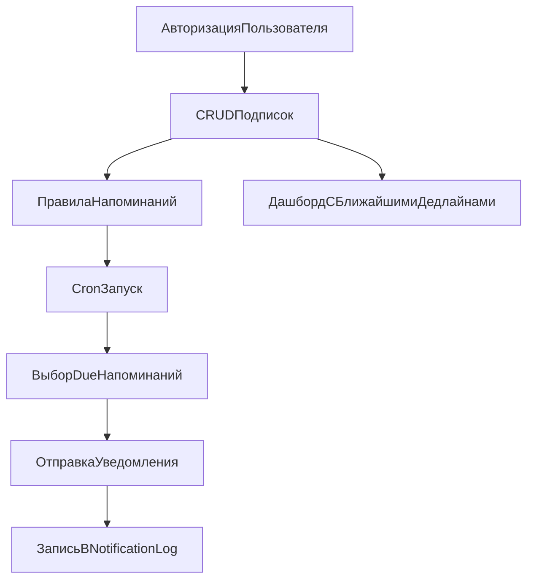

# План развития CancelBefore до MVP

## Границы MVP

- Включаем: авторизацию, управление подписками, правила напоминаний, cron-обработку напоминаний, базовые API и UX-состояния.
- Исключаем из MVP: платежи и биллинг (Stripe/YooKassa/CloudPayments), оставляем на post-MVP.
- Обязательное требование: все пользовательские названия/тексты в интерфейсе — на русском языке (внутренние названия в коде остаются как есть).

## Текущее основание, которое используем

- Роутинг и layout-группы уже готовы: [src/app/layout.tsx](src/app/layout.tsx), [src/app/(marketing)/layout.tsx](src/app/(marketing)/layout.tsx), [src/app/(app)/layout.tsx](src/app/(app)/layout.tsx).
- Есть скелеты страниц: [src/app/(marketing)/page.tsx](src/app/(marketing)/page.tsx), [src/app/(app)/dashboard/page.tsx](src/app/(app)/dashboard/page.tsx), [src/app/(app)/subscriptions/page.tsx](src/app/(app)/subscriptions/page.tsx), [src/app/(app)/subscriptions/new/page.tsx](src/app/(app)/subscriptions/new/page.tsx), [src/app/(app)/subscriptions/[id]/page.tsx](src/app/(app)/subscriptions/[id]/page.tsx).
- База и Prisma-контур есть: [prisma/schema.prisma](prisma/schema.prisma), [src/lib/db.ts](src/lib/db.ts).
- Сервисные API baseline есть: [src/app/api/cron/reminders/route.ts](src/app/api/cron/reminders/route.ts), [src/app/api/webhooks/stripe/route.ts](src/app/api/webhooks/stripe/route.ts).

## Этапы реализации

1. Авторизация и защита app-зоны

- Подключить auth-провайдер (например, NextAuth/Auth.js) и сессии.
- Защитить маршруты `/dashboard` и `/subscriptions/*` от неавторизованного доступа.
- Привязать операции с подписками к текущему `userId`.

1. Backend API для подписок и правил

- Реализовать CRUD API для `Subscription`.
- Реализовать CRUD API для `ReminderRule`.
- Добавить серверную валидацию payload (включая даты `trialEndsAt`, `firstChargeAt`, `cancelByAt`).

1. Реальная cron-логика напоминаний

- Расширить [src/app/api/cron/reminders/route.ts](src/app/api/cron/reminders/route.ts): выбор due-напоминаний, идемпотентная отправка, запись в `NotificationLog`.
- Добавить dry-run режим с детальной статистикой (сколько найдено/отправлено/пропущено).
- Подготовить абстракцию канала уведомлений (пока хотя бы email-stub).

1. Подключение frontend к данным

- Заменить плейсхолдеры на реальные данные в `/dashboard` и `/subscriptions`.
- Реализовать рабочую форму создания/редактирования подписки на `/subscriptions/new` и `/subscriptions/[id]`.
- Добавить состояния: loading/empty/error/success.

1. Полная русификация интерфейса

- Перевести все пользовательские строки в [src/components/layout/header.tsx](src/components/layout/header.tsx), [src/components/layout/footer.tsx](src/components/layout/footer.tsx), [src/components/theme-toggle.tsx](src/components/theme-toggle.tsx) и всех страницах `src/app`.
- Привести `lang` в [src/app/layout.tsx](src/app/layout.tsx) к русскому контенту.
- Зафиксировать единый глоссарий терминов (например: «Подписки», «Напоминания», «Отменить до»).

1. Качество и выпуск MVP

- Добавить минимальные интеграционные тесты для API/cron и smoke-проверки UI.
- Обновить документацию запуска и сценариев проверки MVP.
- Провести релиз-кандидат: ручной прогон основных пользовательских сценариев.

## Целевой поток MVP

## Критерии готовности MVP

- Авторизованный пользователь может создать, просмотреть и обновить подписку с датами дедлайна.
- Cron endpoint реально обрабатывает правила и пишет результаты в `NotificationLog` без дублей.
- Дашборд и список подписок показывают данные из БД, а не заглушки.
- Все пользовательские тексты и названия в UI на русском языке.

